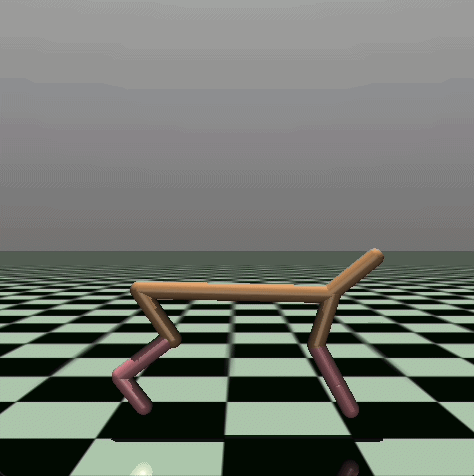
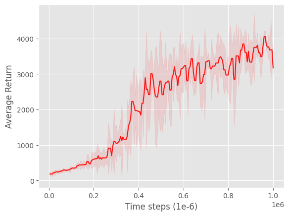
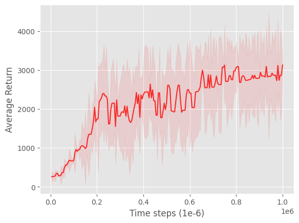
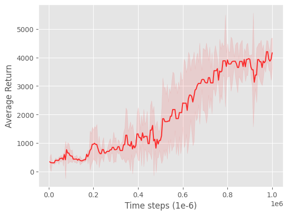
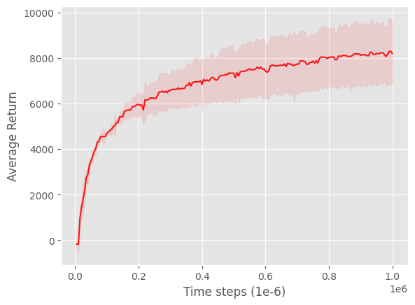
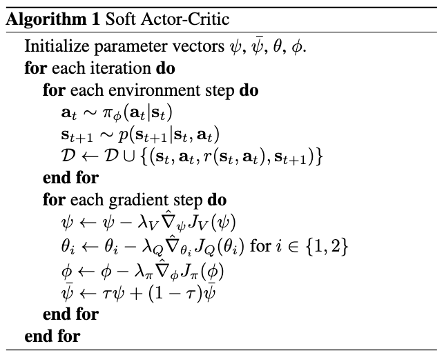
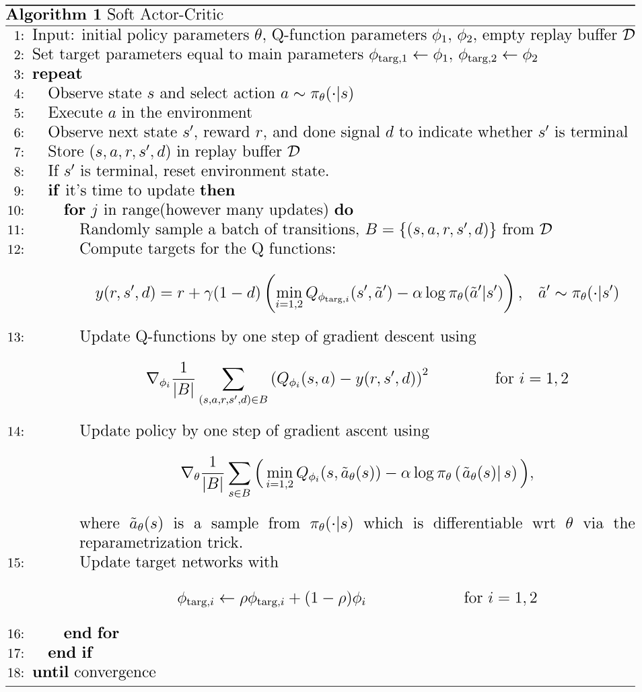

# Soft Actor-Critic: Off-Policy Maximum Entropy Deep Reinforcement Learning with a Stochastic Actor

PyTorch reimplementation of the SAC algorithm first described in the paper: ["Soft Actor-Critic: Off-Policy Maximum Entropy Deep Reinforcement Learning with a Stochastic Actor"](https://arxiv.org/abs/1801.01290) from Haaranoja et al., 2018.

|    |    |    |    |
| -- | -- | -- | -- |
|  |  |  |  |
|  |  |  |   |

This implementation is based on the OpenAI Spinning Up variant of SAC.

## Algorithm

### Quick Facts

* SAC is an off-policy algorithm
* SAC is an model-free algorithm
* SAC is an maximum-entropy algorithm
* SAC is a policy gradient method
* SAC uses clipped double Q-learning (as TD3)
* SAC uses the reparametrization trick

|                              |                    |
| ---------------------------- | ------------------ |
|  | |
| *Soft Actor-Critic Algorithm (SAC) original version. Taken from [Haaranoja et al., 2018](https://arxiv.org/abs/1801.01290).* | *Soft Actor-Critic Algorithm (SAC) OpenAI Spinning Up version. Taken from [OpenAI Spinning Up](https://spinningup.openai.com/en/latest/algorithms/sac.html).* | 


## Usage

```python
import gymnasium as gym
from SAC import SAC, GaussianActorMLP, CriticMLP

env = gym.make("HalfCheetah-v5")
actor = GausssianActorMLP(state_dim=17, h1_dim=256, h2_dim=256, action_dim=6)
critic = CriticMLP(state_dim=17, h1_dim=256, h2_dim=256, action_dim=6)

sac = SAC(
    actor, 
    critic,
    timesteps=1_000_000,
    lr_actor=3e-4,
    lr_critic=3e-4,
    critic_weight_actor=0.0,
    critic_weight_decay=0.0,
    entropy_coef=0.2,
    gamma=0.99,
    tau=0.005,
    buffer_capacity=1_000_000,
    buffer_start_size=25_000,
    device="cpu"
)

td3.train(env)
```

## Experimental setup

* OS: Fedora Linux 42 (Workstation Edition) x86_64
* CPU: AMD Ryzen 5 2600X (12) @ 3.60 GHz
* GPU: NVIDIA GeForce RTX 3060 ti (8GB VRAM)
* RAM: 32 GB DDR4 3200 MHz

For all environments (Humanoid-v5, Hopper-v5, HalfCheetah-v5, Walker2d-v5, Ant-v5) the following hyperparameters were used:

| Hyperparameter | Value |
| -------------- | ----- |
| Learning rate (actor) | 0.0003 |
| Learning rate (critic) | 0.0003 |
| $\gamma$ (discount factor)| 0.99 |
| $\tau$ (polyak averaging) | 0.995 |
| Batch size | 256 |
| Buffer capacity | 1 000 000 |
| Buffer start size| 25 000 

* For HalfCheetah-v5, Hopper-v5 and Walker2d-v5 action_scale was set to 5, and therefore entropy_coef was set to 0.2.

* For Humanoid-v5 and HumanoidStandup-v5 action_scale was set to 20, and therefore entropy_coef was set to 0.05.

## Citations

```bibtex
@misc{haarnoja2018softactorcriticoffpolicymaximum,
      title={Soft Actor-Critic: Off-Policy Maximum Entropy Deep Reinforcement Learning with a Stochastic Actor}, 
      author={Tuomas Haarnoja and Aurick Zhou and Pieter Abbeel and Sergey Levine},
      year={2018},
      eprint={1801.01290},
      archivePrefix={arXiv},
      primaryClass={cs.LG},
      url={https://arxiv.org/abs/1801.01290}, 
}
```